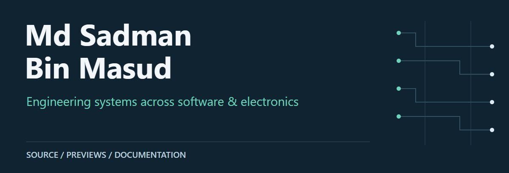
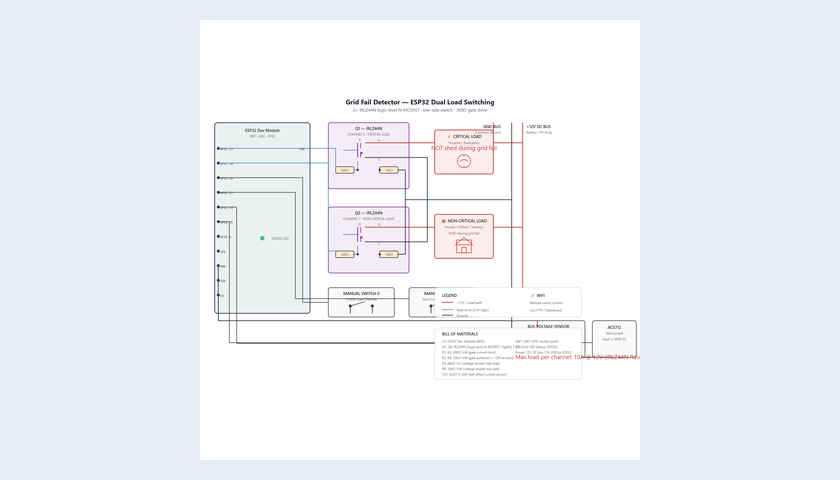
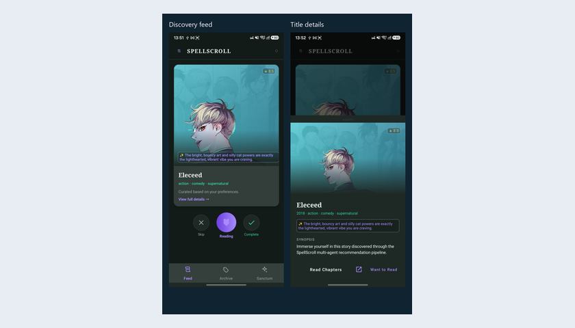
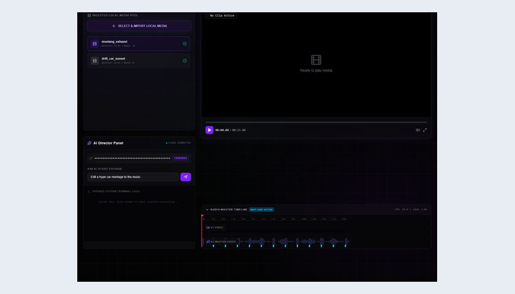
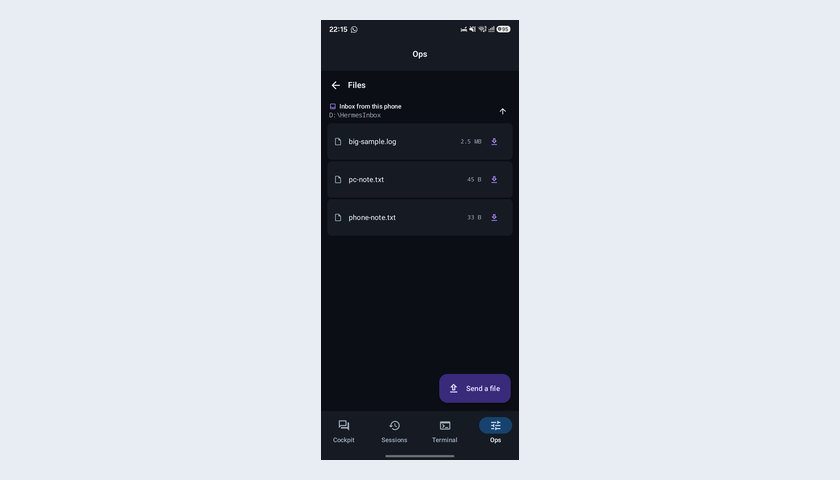
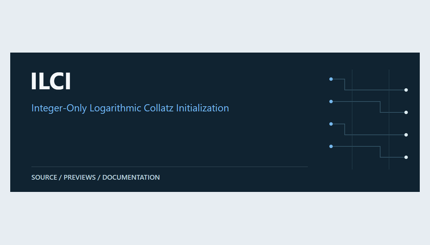
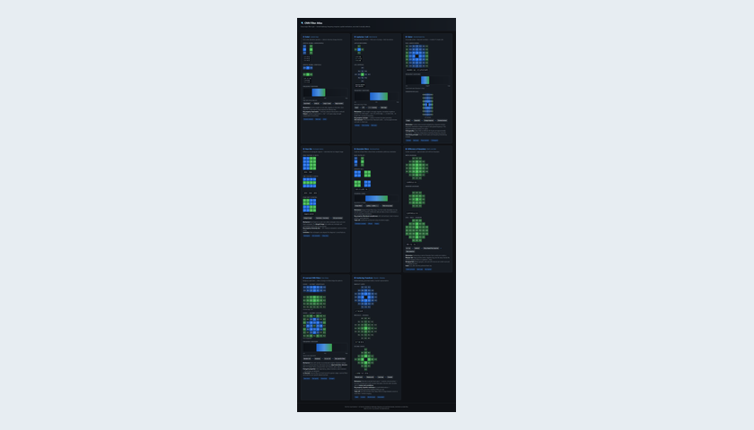

# Md Sadman Bin Masud

EECE student at MIST, Dhaka. I build across **agent tooling, native apps, web interfaces and embedded-system research**.

[Browse all repositories](https://github.com/MdSadman20040812?tab=repositories) · [Portfolio source](https://github.com/MdSadman20040812/MdSadman20040812.github.io)

## Selected work

<table>
<tr>
<td width="50%" valign="top">

<h3><a href="https://github.com/MdSadman20040812/hybrid-solar-grid">Hybrid Solar–Grid</a></h3>

Control software, simulation and electronics.

</td>
<td width="50%" valign="top">

<h3><a href="https://github.com/MdSadman20040812/SpellScroll">SpellScroll</a></h3>

Webtoon discovery across web and Android.

</td>
</tr>
<tr>
<td width="50%" valign="top">

<h3><a href="https://github.com/MdSadman20040812/Laura_AI">Laura AI</a></h3>

Tauri editing workspace; browser mock preview.

</td>
<td width="50%" valign="top">

<h3><a href="https://github.com/MdSadman20040812/hermes-mobile">Hermes Mobile</a></h3>

Android access to a desktop Hermes host.

</td>
</tr>
<tr>
<td width="50%" valign="top">

<h3><a href="https://github.com/MdSadman20040812/ILCI">ILCI</a></h3>

Collatz initialization benchmark for ATmega328P.

</td>
<td width="50%" valign="top">

<h3><a href="https://github.com/MdSadman20040812/frontend-designs">Frontend Designs</a></h3>

CNN filters explained visually in the browser.

</td>
</tr>
</table>

## Explore by area

| Area | Projects |
| :-- | :-- |
| Agent tooling | [AgentForge](https://github.com/MdSadman20040812/AgentForge) · [hermes-orchestrator](https://github.com/MdSadman20040812/hermes-orchestrator) · [hermes-remote](https://github.com/MdSadman20040812/hermes-remote) |
| Applied workflow prototypes | [LexisClear](https://github.com/MdSadman20040812/LexisClear) · [TerraTrace](https://github.com/MdSadman20040812/TerraTrace) · [Vanguard](https://github.com/MdSadman20040812/Vanguard) · [ProjectAegis](https://github.com/MdSadman20040812/ProjectAegis) |
| Electronics & research | [hybrid-solar-grid](https://github.com/MdSadman20040812/hybrid-solar-grid) · [ILCI](https://github.com/MdSadman20040812/ILCI) · [ZeroADC](https://github.com/MdSadman20040812/ZeroADC) · [hardware-visualizations](https://github.com/MdSadman20040812/hardware-visualizations) |
| Local tools & collections | [bp-local-monitor](https://github.com/MdSadman20040812/bp-local-monitor) · [frontend-designs](https://github.com/MdSadman20040812/frontend-designs) · [projects](https://github.com/MdSadman20040812/projects) |

## How I approach the work

- **Make it inspectable.** Keep source, design files and evidence close together.
- **Separate prototype from proof.** Label simulations, browser mocks and research artifacts honestly.
- **Prefer useful systems.** Connect the interface to the engineering beneath it.

### Technologies in these repositories

Python · TypeScript · React · Kotlin · Jetpack Compose · Rust / Tauri · Django · FastAPI · LangGraph · Arduino

---

Previews link to their projects. Repository READMEs explain the setup and current limitations.
